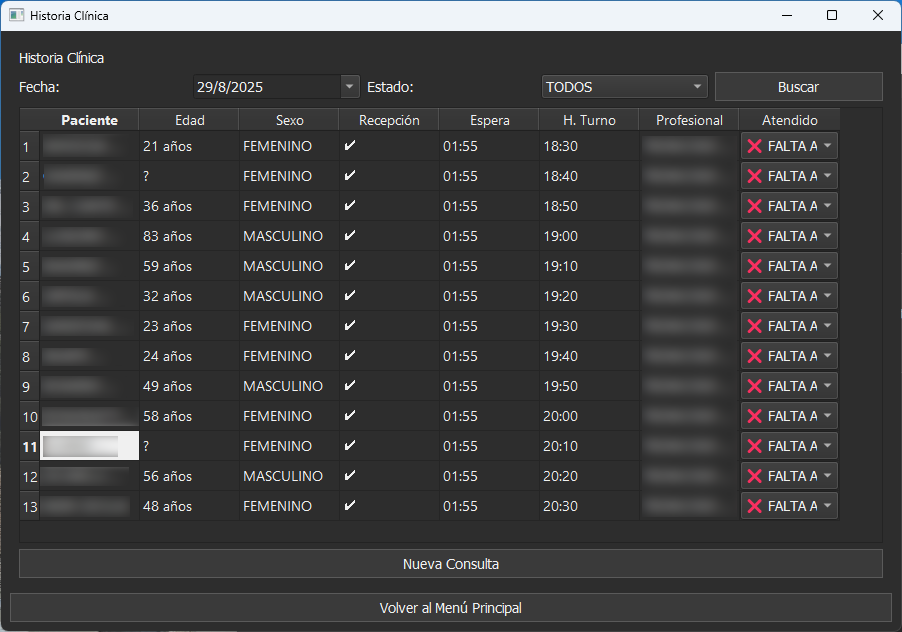

# ICB Historias Clínicas

<div align="center">
  
</div>

<div align="center">
  SISTEMA DE GESTIÓN DE HISTORIAS CLÍNICAS
</div>

---

## Tabla de Contenidos

- [Sobre](#sobre)
- [Características](#características)
- [Capturas de Pantalla / Screenshots](#capturas-de-pantalla)
- [Empezando](#empezando)
  - [Hecho con](#hecho-con)
  - [Instalación](#instalación)
  - [Ejecutable](#ejecutable)
- [Autor](#autor)
- [Licencia](#licencia)
- [Reconocimientos](#reconocimientos)

---

## Sobre
**ICB Historias Clínicas** es un sistema de gestión diseñado para la Clínica Banfield. Permite organizar turnos, agendas, pacientes e informes médicos de manera centralizada, facilitando el acceso rápido y seguro a la información clínica.

---

## Características

- **Turnos y Agendas**: búsqueda de turnos por fecha y gestión de evoluciones médicas.
- **Informes**: consulta e impresión de informes de pacientes.
- **Historias Clínicas**: búsqueda e impresión del historial clínico del paciente.
- **Gestión de Pacientes**: búsqueda por nombre o DNI.
- **Instalador propio**: incluye todas las dependencias necesarias.

---

## Capturas de Pantalla

<div align="center">
<table>
<tr>
  <td><b>Menu Principal</b><br></td>
  <td><b>Turnos</b><br></td>
</tr>
<tr>
  <td><b>Pacientes</b><br></td>
  <td><b>Historial</b><br></td>
</tr>
<tr>
  <td><b>Evolución</b><br></td>
  <td><b>Permisos</b><br></td>
</tr>
</table>
</div>

---

## Empezando

### Hecho con
- **Python 3.11**
- **PyInstaller** para generar el ejecutable
- **PyQt** para la interfaz gráfica
- **MS ODBC Driver** para conexión con base de datos SQL Server

---

### Instalación
1. Clonar el repositorio:
   ```sh
   git clone https://github.com/jonybhm/app_clinica_banfield.git
   ```
2. Instalar dependencias de Python:
   ```sh
   pip install -r requirements.txt
   ```
3. Ejecutar la aplicación en modo desarrollo:
   ```sh
   python main.py
   ```

---

### Ejecutable
Si no deseás instalar dependencias manualmente, podés descargar el **instalador oficial** aquí:  
[Descargar Instalador ICB](https://github.com/jonybhm/app_clinica_banfield/tree/main/releases/latest/download)

Descargar el instalador para **Microsoft ODBC Driver 18 for SQL Server (x64)** aquí:  
[Descargar Instalador ODBC](https://learn.microsoft.com/en-us/sql/connect/odbc/download-odbc-driver-for-sql-server?view=sql-server-ver17)

---

## Autor
Desarrollado por [Jonathan De Castro](https://github.com/jonybhm).  

---

## Licencia
Este proyecto está autorizado bajo la **Licencia MIT**.  
Consulta [LICENSE](LICENSE) para más información.

---

## Reconocimientos
- ["Instituto Cardiológico Banfield"](https://www.institutocardiologicobanfield.com/) por el caso de uso real  
- Comunidad de Python y PyInstaller  
- Inno Setup por el empaquetado del instalador